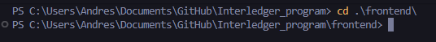

# User Manual - Secure Artisan Payment with Interledger

## 1. Open the folder in Visual Studio Code


## 2. Enter the backend folder
```bash
cd .\backend\
```


## 3. Install Express
```bash
npm install express
```


## 4. Open a new terminal and go to the frontend folder
```bash
cd .\frontend\
```


## 5. Install Vite
```bash
npm install vite
```


## 6. Configure environment variables  
From the VSCode file explorer, open the `.env` file.


## 7. Modify authentication data  
Update the following values: `KEY_ID`, `SENDER`, `RECEIVER` with the credentials from your own wallet for authentication.


## 8. Replace the private key  
Locate the `private.key` file and replace the private key with the one from your wallet.


## 9. Go back to the backend terminal  

## 10. Run the backend services
```bash
node .\index.js
```


## 11. Open the frontend terminal  

## 12. Run the frontend services
```bash
npm run dev
```


## 13. Access the web application  
The terminal will display the web page link `http://localhost:5173/`. Open the link.


## 14. Log in  
Log into the web page with the following credentials:
- **User:** alex.g.g5387@gmail.com  
- **Password:** alex1010A_

## 15. Make a purchase  
Browse the website, purchase a product, and send an incentive.


## 16. Validate the payment  
Validate the payment, return to the page, and confirm the payment.
