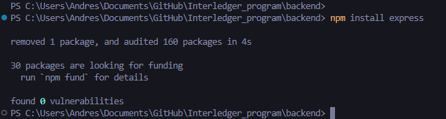
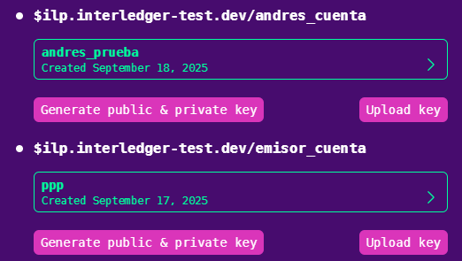
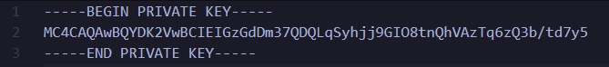
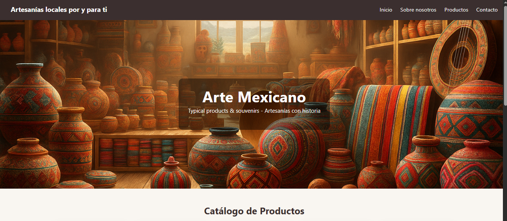

# Manual de uso - Pago seguro artesanal con Interledger

## 1. Abrir la carpeta desde Visual Studio Code


## 2. Ingresar a la carpeta del backend
```bash
cd .\backend\
```


## 3. Instalar Express
```bash
npm install express
```


## 4. Abrir nueva terminal y acceder a la carpeta frontend
```bash
cd .\frontend\
```


## 5. Instalar Vite
```bash
npm install vite
```


## 6. Configurar variables de entorno
Desde el explorador de archivos de VSCode, ingresar al archivo `.env`


## 7. Modificar los datos de autenticación
Modificar los datos: `KEY_ID`, `SENDER`, `RECEIVER` por los datos de su propia wallet para la autenticación.



## 8. Reemplazar la llave privada
Buscar el archivo `private.key` y reemplazar la llave privada por la de su wallet.



## 9. Regresar a la terminal del backend

## 10. Ejecutar los servicios del backend
```bash
node .\index.js
```


## 11. Abrir la terminal del frontend

## 12. Ejecutar los servicios del frontend
```bash
npm run dev
```


## 13. Acceder a la aplicación web
En la terminal se generará el link de la página web `http://localhost:5173/`. Ingresar al link.


## 14. Iniciar sesión
Iniciar sesión en la página web con las siguientes credenciales:
- **Usuario:** alex.g.g5387@gmail.com
- **Contraseña:** alex1010A_

## 15. Realizar una compra
Navegar por la página y hacer la compra de algún producto y enviar un incentivo.



## 16. Validar el pago
Validar el pago, regresar a la página y confirmar el pago.