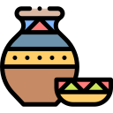

# Secure Artisan Payment with Interledger  

  

## What is the problem?  
Many artisans struggle to receive secure and reliable payments for their products. Customers are often reluctant to pay upfront, and traditional methods such as bank transfers, cash, or local mobile payments can be slow, costly, insecure, or lack interoperability.  

This generates mutual distrust, delivery delays, and in some cases, loss of sales. In addition, artisans lack digital tools that allow them to formalize their transactions, issue receipts, and keep reliable payment records, limiting their professionalization, growth, and ability to compete in a broader, even international, market.  

## What technology will be used?  
The solution will be built on modern and secure technologies:  
- **Node.js**: For backend logic and direct integration with the Interledger Open Payments API.  
- **React.js**: Frontend framework to create an intuitive, adaptable, and user-friendly interface.  
- **Vite**: Development tool that speeds up compilation and deployment of the web application.  
- **Open Payments API (Interledger)**: The core of the solution to process payments quickly, securely, without withholding, and with global reach.  

## What is the solution?  
The proposal is to develop a **web application** that allows artisans to receive digital payments securely and directly. The customer will be able to select the artisan, the product, enter the amount, and process the payment in seconds.  

- Increases trust between customers and artisans.  
- Reduces risks of non-payment or fraud.  
- Allows registering and formalizing all transactions.  
- Connects artisans to a broader market, including national and international clients.  

## What are the benefits?  
- **Security**: Direct and traceable payments without withholding.  
- **Business growth**: Increase in clients and sales.  
- **Efficiency**: Instant payments with lower operating costs.  
- **Expansion**: Opportunity to access global markets.  
- **Formalization**: Accessible payment receipts and records.  
- **Better customer experience**: Simplicity and speed in the purchase process.  

## What is the simple architecture/stack?  
1. **Login and authentication**: User validation (artisans and clients).  
2. **Home**: Catalog of artisans with their products.  
3. **Payment page**: Select recipient, amount, and process secure payment via Interledger.  
4. **Confirmation**: Release of payment.  

## What functions are essential? Who will be responsible for each part?  
### Essential functions  
- Secure connection with the Open Payments API.  
- Authentication of access keys and payment validation.   

### Team responsibilities  
- **Frontend Developer**: Build the web interface in React.js, usability, and responsive design.  
- **Backend Developer**: Handle users, integration with the Interledger API, and payment logic.  
- **UX/UI Designer**: Define a simple and attractive payment flow for users.  
- **Project Manager**: Coordinate the team, timeline, and deliverables.  
